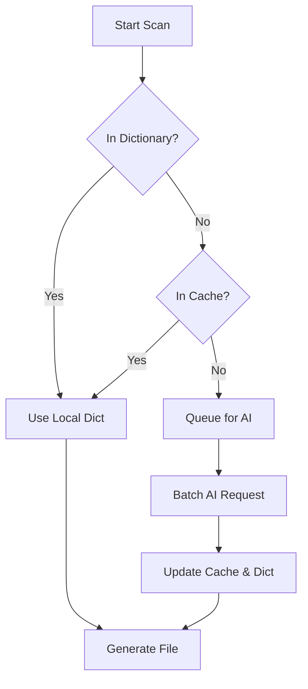

<div align="center">

# Arabic Localization Helper

### The Enterprise-Grade AST Transformation Engine for Arabic Localization

[](https://www.npmjs.com/package/arabic-localization-helper)
[](https://opensource.org/licenses/ISC)
[](https://nodejs.org/)
[](https://www.typescriptlang.org/)

</div>

---

## ⚡ Executive Summary

**Arabic Localization Helper** is not just a "translator"—it is a sophisticated **Code Transformation Engine** that creates Arabic versions of your web projects with surgical precision. Built on an **AST (Abstract Syntax Tree)** core rather than regex, it guarantees code safety while employing a **Hybrid AI Engine** with **Smart API Rotation** to handle enterprise-scale localization.

---

## ⚔️ The Problem vs. The Solution

| The Bottleneck (Manual/Regex)                                                                                   | The Architecture (Arabic Localization Helper)                                                                                       |
| :-------------------------------------------------------------------------------------------------------------- | :---------------------------------------------------------------------------------------------------------------------------------- |
| **Fragile Parsing:** Regex-based tools often break code by translating variables, function names, or API props. | **AST Precision:** Uses `acorn` to parse JavaScript/TypeScript into an Abstract Syntax Tree, modifying _only_ safe string literals. |
| **API Rate Limits:** Hitting 429 errors halts the entire build pipeline.                                        | **Infinite Rotation Engine:** Automatically cycles through a pool of API keys on failure, ensuring zero downtime.                   |
| **Tedious CSS Work:** Manually flipping margins/padding (`margin-left` → `margin-right`) is error-prone.        | **Zero-Config RTL:** Automatically converts CSS/SCSS/LESS to RTL logic using logical property transformation.                       |
| **Vendor Lock-in:** Stuck with expensive SaaS subscriptions.                                                    | **Local-First Hybrid:** Uses a local dictionary cache first, only calling AI for missing tokens.                                    |

</br>

## 💎 Core Architecture

<div align="center">

<table>
  <tr>
    <td align="center" width="200">
      <h1>🛡️</h1>
      <h3>AST Code Safety</h3>
      <p>Parses JS/TS logic. Never touches imports, variables, or logic.</p>
    </td>
    <td align="center" width="200">
      <h1>🔄</h1>
      <h3>Infinite Rotation</h3>
      <p>Smart load-balancing across multiple Gemini API keys.</p>
    </td>
  </tr>
  <tr>
    <td align="center" width="200">
      <h1>⬅️</h1>
      <h3>Zero-Config RTL</h3>
      <p>Auto-injects <code>dir="rtl"</code> and flips CSS geometry.</p>
    </td>
    <td align="center" width="200">
      <h1>🔒</h1>
      <h3>No-Mutation Policy</h3>
      <p>Original source files are read-only. Creates atomic <code>-ar</code> clones.</p>
    </td>
  </tr>
</table>

</div>

---

## 🚀 Installation & Quick Start

### Option A: The npx Workflow (Recommended)

No installation required. Run directly from the cloud.

```bash
npx arabic-localization-helper scan --project "./src"
```

### Option B: Local Installation

For CI/CD pipelines or frequent use.

```bash
npm install -g arabic-localization-helper
```

### The "Preview -> Translate" Workflow

We believe in trust but verify.

1.  **Scan (Dry Run):** See exactly what _would_ change.
    ```bash
    npx arabic-localization-helper scan
    ```
2.  **Translate (Execute):** Commit the changes.
    ```bash
    npx arabic-localization-helper translate
    ```

---

## 🧠 The Hybrid AI Engine

The engine follows a strict waterfall logic to optimize for **Speed > Cost > Accuracy**.



---

## 🔄 Resilience: The API Key Rotation System

Enterprise builds cannot fail just because one API key hit a rate limit. Our **Smart Rotation System** handles this autonomously.

### Configuration

Create a `.env` file with your keys. The system accepts a comma-separated pool.

```env
GEMINI_API_KEYS="key_A_123,key_B_456,key_C_789"
```

### How It Works (Terminal Simulation)

The engine monitors HTTP 429 (Too Many Requests) and 401/403 (Unauthorized) signals.

```bash
> Initializing Translation Engine...
> [Key Rotation] Using key #1/3 (AIza...)
> [Warning] Key #1 failed: Rate limit reached (HTTP 429) → trying next key
> [Key Rotation] Using key #2/3 (AIza...)
> [Success] Key #2 succeeded. Batch processed 150 words.
```

_This guarantees your pipeline completes even under heavy load._

---

## 🛡️ Developer Experience (DX)

### Intelligent Exclusions

The scanner automatically ignores non-content directories to save resources:

- `node_modules`
- `.git`
- `dist` / `build`
- `*.test.ts` / `*.spec.js`

### AST-Based Safety

Unlike regex replacers, our AST walker understands context.

```typescript
// Original Code
const userName = "Welcome Back"; // Translated ✅
const apiKey = "xyz-123-token";  // Ignored (Heuristic Check) ❌
import { "Something" } from "lib"; // Ignored (Import Statement) ❌
```

---

## 📜 License

ISC License © [Ahmed El-hadad](https://github.com/AhmedEl-hadad)
